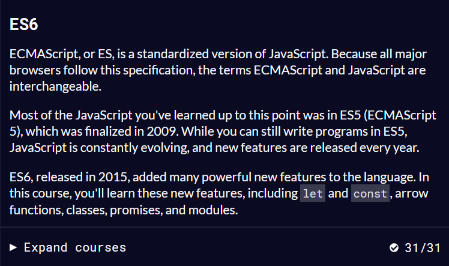

### 1. Đồng độ và bất đồng bộ

#### 1.1. Đồng bộ

- Đồng bộ tức là code sẽ chạy theo thứ tự lần lượt từ trên xuống dưới
- Ưu: Do các câu lệnh được chạy lần lượt nên sẽ dễ kiểm soát hơn, ngoài ra nếu có bất kỳ lỗi nào thì chương trình cũng sẽ dừng lại mà không chạy tiếp.
- Nhược: Đôi khi chúng ta cần lấy dữ liệu từ bên ngoài (đọc file, lấy dữ liệu từ DB, ...) nên sẽ cần một thời gian chờ nhất định. Nếu chúng ta thực hiện theo kiểu đồng bộ, thì thời gian chạy của toàn bộ chương trình sẽ bằng tổng thời gian thực hiện từng câu lệnh một

#### 1.2. Bất đồng bộ

- Bất đồng bộ tức code sẽ được chạy một cách song song, đồng thời
- Ưu: Tối ưu được thời gian chạy của các câu lệnh
- Nhược: Khó kiểm soát cũng như debug code.

### 2. Javascript

- Javascript là ngôn ngữ đồng bộ và single threaded, Js chỉ bất đồng bộ trong một vài tình huống nhất định ví dụ như gọi Ajax
- Lí do: Bởi hầu hết trong các tình huống các câu lệnh của Javascript đều được chạy theo thứ tự từ trên xuống dưới

### 3. Callback Function

- Callback function là một function được truyền vào một function, cái mà sẽ được gọi ở bên trong function phía ngoài nó vào tại một thời điểm nào đó trong tương lai.
- Hạn chế: Lạm dụng có thể gây ra callback hell (khi mà các callback function được lồng vào nhau thành nhiều lớp)
- Ví dụ: `array.map((value)=>1)`

### 4. Promise

- Promise là một đối tượng thể hiện trạng thái hoàn thành hoặc thất bại của một hoạt động bất đồng bộ và kết quả của hành động đấy
- Ví dụ tình huống sử dụng Promise: Khi cần xử lí bất đồng bộ, ví dụ như làm việc với setTimeout
- Các thành phần của Promise bao gồm: 1 callback function, bên trong callback funtion đấy bao gồm 2 callback funtion khác tạm gọi là resolve và reject

- Ví dụ Promise:
  `Const promise = new Promise((resolve,reject)=>{ resolve(“Always resolve Promise”) })`

### 5. Promise.all():

- Chạy nhiều quá trình bất đồng bộ cùng lúc và trả về kết quả là một Promise với resolve value là một array chứa các kết quả của các quá trình bất đồng bộ đã gọi tương ứng. Promise.all sẽ reject khi một quá trình được trình được truyền vào reject
- Ví dụ: `Promise.all([Promise1,Promise2]).then(([value1,value2])=>{ //do something })`

### 6. Async, Await

- Async func là function được khai báo với từ khóa async, await là từ khóa được phép sử dụng trong async function:

* Async function trả về 1 Promise
* Async function chỉ thực sự được coi là bất đồng bộ khi mà nó có sử dụng từ khóa await, nếu ko sử dụng await bên trong, async sẽ được coi như là hàm đồng bộ thông thường

- Cú pháp:
  `const myFunc = async () => { const res = await new Promise((resolve,reject)=>{ resolve(“Always resolve Promise”) }) }`
- Ưu điểm so với Promise: Code gọn và dễ debug hơn
- Nhược điểm so với Promise: Không có

### 7. Thực hành

