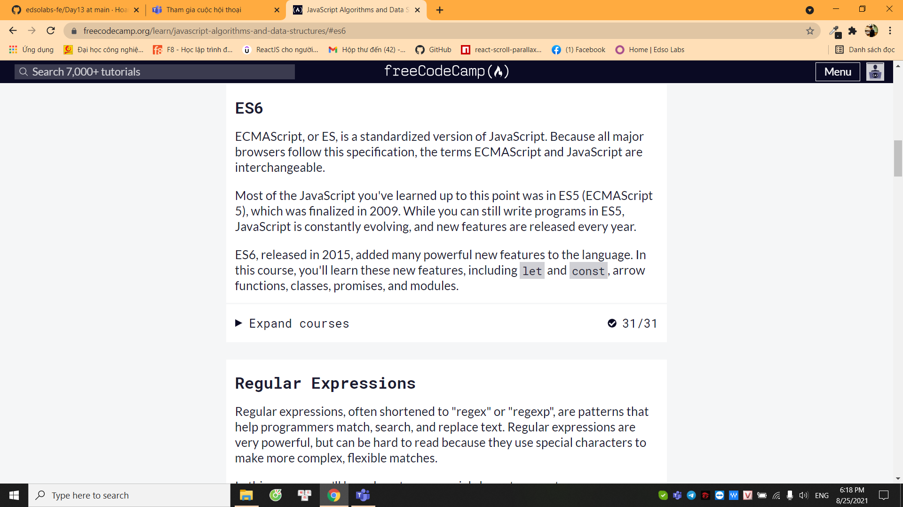

### Lý thuyết về ES6 - by nhom1.

---

##### 1, Đồng bộ là gì , ưu nhược điểm của đồng bộ

- **đồng bộ** là chương trình sẽ chạy từ trên xuống dưới , line by line, thực hiện theo thứ tự lần lượt câu lệnh thứ nhất phải hoàn thành thì mới chạy lâu lệnh thứ 2 ....
- **ưu điểm** là các câu lệnh chạy tuần tự nên dễ kiểm soát, nếu như có lỗi thì trương trình sẽ dừng lại mà k chạy tiếp
- **nhươc điểm** là khi chúng ta lấy dữ liệu từ API v.v thì thời gian của toàn bộ chương trình sẽ bằng tổng thời gian thực hiện của 1 câu lệnh 1

##### 2, Bất Đồng bộ là gì , ưu nhược điểm của bất đồng bộ

- **bất đồng bộ** chương trình sẽ chạy 1 lúc nhiều câu lệnh,
- **ưu điểm** nó giúp chúng ta tối ưu được thời gian chạy lệnh, giúp chạy những tác vụ mất nhiều thời gian mà không ảnh hưởng đến luồng chính của trương trình
- **nhươc điểm** vì các câu lệnh được thực hiện đồng thời và trả về kết quả k theo thứ tự nên khó kiểm soát code , debug code về lâu dài

##### 3, JS là ngôn ngữ lập trình bất đồng bộ , và chỉ chạy khi nó thao tác với các webAPI(ajax,setTimeout())

##### 4, CallBack là hàm sẽ được thực thi sau khi 1 hàm khác đã thực thi xog

- **ưu điểm** nó có thể sử lí bất đồng bộ được
- **hạn chế** khi thực hiện nhiều thao tác , logic thì sẽ bị callBackhell , khiến code trở nên khó đọc , khó hiểu , rối rắm , và khó debug
- **ví dụ**

```php
 function doHomework(subject, callback) {
    console.log(`Bắt đầu làm bài tập ${subject}.`);
    callback();
}

doHomework('math', function() {
    console.log('Làm bài tập xong!');
});
```

##### 5, Promise là 1 cơ chế giúp chúng ta sử lý các tác vụ về bất đồng bộ mà k bị rơi vào callBackHell

- khởi tạo : tao sẽ dung từ khóa new Promise()
- bên trong hàm sẽ nhận 1 excuter function gồm 2 tham số là resolve , reject
- resolve() là hàm thực hiện logic thành công ,
- reject() là hàm thực hiện logic thất bại
- khi logic thành công thì kết quả sẽ lọt vào .then
- khi logic thất bại thì kết quả sẽ lọt vào .catch
- Promise All là 1 hàm để chúng ta xử lý đồng thời nhiều hành vi bất đồng bộ
  sẽ trả ra kết quả khi các hành vi đượcthực hiện xong
- **ví dụ**

```php
var p1 = Promise.resolve(3);
var p2 = 1337;
var p3 = new Promise((resolve, reject) => {
  setTimeout(() => {
    resolve("foo");
  }, 100);
});
Promise.all([p1, p2, p3]).then(values => {
  console.log(values); // [3, 1337, "foo"]
});
```

#### Nâng cao

##### async/ await

- Async / Await là một tính năng của JavaScript giúp chúng ta làm việc với các hàm bất đồng bộ theo cách thú vị hơn và dễ hiểu hơn. Nó được xây dựng trên Promises và tương thích với tất cả các Promise dựa trên API
  cú pháp
  async function name([param[, param[, ...param]]]) {
  statements
  }
- +ưu điểm và nhược điểm của Async / await so với promise - Ưu điểm - Code ngắn và sạch hơn: đơn giản chỉ là code ngắn gọn hơn - sử lý lỗi/error đồng bộ và bất đồng bộ theo cùng 1 cấu trúc(sử dụng try catch) - debug đơn giản promise
  -nhược điểm -vì thằng Async/ await ra đời sau nên nó khác phục được nhiều yếu điểm của thằng promise
  
