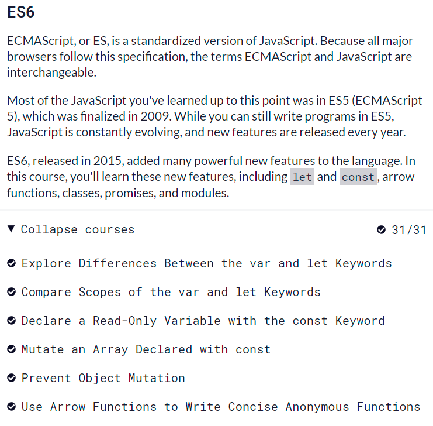

Day13: Tìm hiểu Callback, Promise, Async-Await

Các nhóm tìm hiểu lý thuyết về :
Đồng bộ là gì? Bất đồng bộ là gì? Ưu và nhược điểm của chúng?
JS là ngôn ngữ đồng bộ hay bất đồng bộ? Tại sao?
CallBack function là gì, ưu điểm, hạn chế của CallBack Function? Cho ví dụ về CallBack function.
Promise là gì, ví dụ tình huống về trường hợp nên sử dụng Promise. Các thành phần của của 1 Promise, ví dụ về Promise.
Promise All là gì? Ví dụ tình huống về trường hợp sử dụng Promise All.
Phần nâng cao
Async - Await là gì? Cú pháp của Asyns-Await ra sao?
Ưu và nhược điểm của Asyns - Await với Promise.

Trả Lời

-Đồng bộ và bất đồng bộ
+đồng bộ là gì
	-là code được chạy tuần tự theo trình tự đã viết sãn từ trên xuống dưới, code bên dưới là chỉ chạy khi code ở trên đã chạy xong và trả ra kết quả
+bất đồng bộ
	-là code phía dưới có thể chạy dù code bên trên chưa thực thi hoặc trả về kết quả
+ưu điểm và nhược điểm của đông bộ
	là code chạy tuần tự từ trên xuống dưới và dễ debug nhưng lại mất thời gian vì phải chở code ở trên thực thi xong thì mới chạy code ở dưới
+ưu điểm và nhược điểm của bất đồng bộ
	là code chạy không tuần tự có thể đẩy nhanh tốc độ trả về kết quả vì không phải chờ code trên, 
+JS là ngôn ngữ đồng bộ hay bất đồng bộ? Tại sao?
	javascritp là ngôn ngữ lập trình bất đồng bộ và là ngôn ngữ xử lý đơn luồng.
	tại vì khi chạy code của javascript sẽ không chờ code phía trên chạy xong nếu chưa chạy xong thì nó sẽ đẩy code chờ lên browser chờ rồi chạy code sau
	

+ callback là gì
	- Trong JavaScript, hàm là đối tượng. Do đó, các hàm có thể lấy các hàm làm đối số và có thể được trả về bởi các hàm khác
 	-  Bất kỳ hàm nào được truyền dưới dạng đối số được gọi là hàm callback.

+ tại sao lại cần callback 
 	Chúng ta cần hàm callback vì một lý do rất quan trọng - JavaScript là ngôn ngữ hướng sự kiện.
Điều này có nghĩa là thay vì chờ phản hồi trước khi tiếp tục, JavaScript sẽ tiếp tục thực thi trong khi lắng nghe các sự kiện khác.
 	- mục đích của callback là đảm bảo code sẽ không hoạt động trước khi các code khác hoàn thành việc thực thi
+ ưu điểm của callback
	- giúp code có thể chạy đồng bộ trong javascript
+ hạn chế của callback
	- khi thực thi quá nhiều tác vụ lồng nhau thì sẽ sinh ra callbackhell dẫn đễn, khó debug và kiểm tra
	
+ví dụ về callback
			function doHomework(subject, callback) {
    console.log(`Bắt đầu làm bài tập ${subject}.`);
    callback();
}

doHomework('math', function() {
    console.log('Làm bài tập xong!');
});
--------promise-------------------
+ promise là gì
	-Promise là một cơ chế trong JavaScript giúp thực thi các tác vụ bất đồng bộ mà không rơi vào callback hell , là tình trạng các hàm callback lồng vào nhau ở quá nhiều tầng.
+ Những trường hợp nên sử dụng promise
	- sử dụng khi gửi và nhận Ajax request, gọi hàm bên bên trong setTimeout, setInterval 
+ các thành phần trong promise gồm
	- resovle và reject là 2 hàm callback của promise khi đúng thì trả dữ thông tin cho resovle còn ngược lại là cho reject
	- then, catch, finaly kết quả đúng thì then ở đằng sau được chạy tiếp còn nếu có lỗi sai ở promise hoặc then thì sẽ reject sẽ trả vào catch,finaly bắt được cả 2 trường hợp

+ ví dụ về promise
	const p = Promise.resolve(12)
  .then(result => console.log(result)) // 12
  .then(res => Promise.reject(new Error('Dừng lại nhanh')))
  .then(() => 'Cười thêm phát nữa là tym anh đứt phanh')
  .catch(err => console.error(err)) // Error: Dừng lại nhanh

---------promise all

+ Promise All là gì
	- Giúp chạy song song các promise, hợp nhất các promise trả về 1 mảng là kết quả của các promise đầu vào
	  Trong trường hợp có lỗi xảy ra, tất cả các promise khác dù đã kết thúc hay chưa thì đều không được quan tâm nữa.
+ ví dụ về promise all
	var promise1 = new Promise(
	    function (resolve) {
	        setTimeout(function () {
	            resolve([1, 2]);
	        }, 2000);
	    })
	var promise2 = new Promise(
	    function (resolve) {
	        setTimeout(function () {
	            resolve([3]);
	        }, 5000);
	    })
	    Promise.all([promise1, promise2])
	    .then(function(result) {
	        console.log(result);
	    })

+ Async/ awit là gì
	-Async / Await là một tính năng của JavaScript giúp chúng ta làm việc với các hàm bất đồng bộ theo cách thú vị hơn và dễ hiểu hơn. Nó được xây dựng trên Promises và tương thích với tất cả các Promise dựa trên API. Trong đó:

Async - khai báo một hàm bất đồng bộ (async function someName(){...}).

Tự động biến đổi một hàm thông thường thành một Promise.
Khi gọi tới hàm async nó sẽ xử lý mọi thứ và được trả về kết quả trong hàm của nó.
Async cho phép sử dụng Await.
Await - tạm dừng việc thực hiện các hàm async. (Var result = await someAsyncCall ()😉.

Khi được đặt trước một Promise, nó sẽ đợi cho đến khi Promise kết thúc và trả về kết quả.
Await chỉ làm việc với Promises, nó không hoạt động với callbacks.
Await chỉ có thể được sử dụng bên trong các function async.

