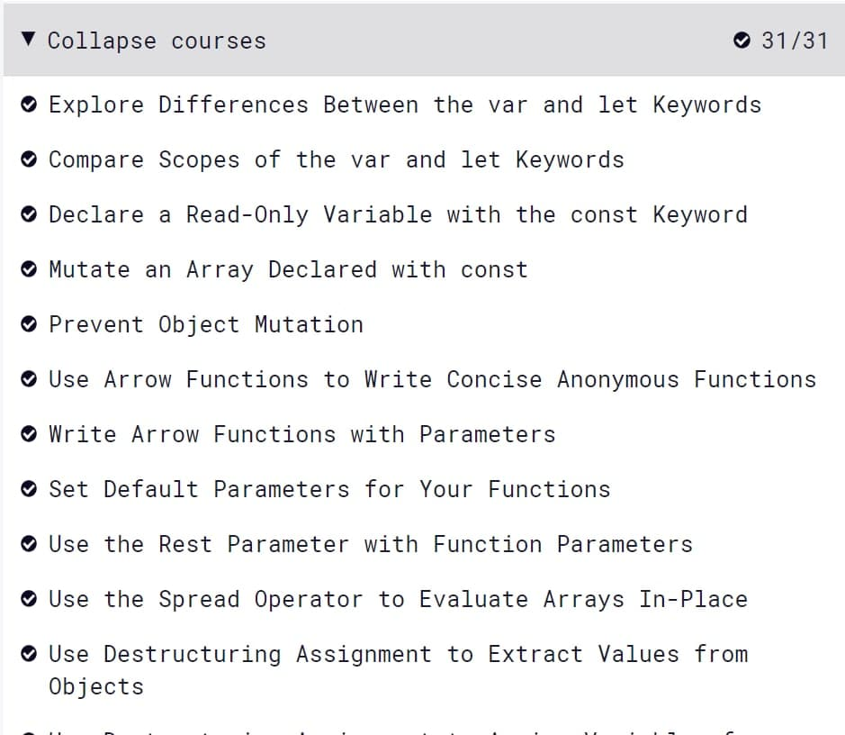

## VAR - LET - CONST

Const: có scope là code block, nếu giá trị đưuọc gkhởi tạo là kiểu dữ liệu nguyên thủy thì sẽ không thể cập nhật lại giá trị

Var: khi được khai báo bên trong function thì nó sẽ có scope la function, còn lại thì sẽ có scope là global. Tính năng hosting của var, dù được khai báo ở đâu thi khi chạy sẽ được đem lên đầu của scope để thực hiện, có thể thay đổi giá trị

Let: let có hosting nhưng cần khởi tạo giá trị nếu không sẽ có lỗi, có scope là code block và có thể thay đổi giá trị

Global scope: khi được khai báo thì bất cứ đâu trong file .js đê có thể sử dụng biến này
Code block: được bao bằng dấu ngoặc nhọn {ư} khi được khai báo let, const
Local: phạm vị này bên trong một hàm, khai báo var

Mutate an Array Declared with const

However, it is important to understand that objects (including arrays and functions) assigned to a variable using const are still mutable. Using the const declaration only prevents reassignment of the variable identifier.

Tuy nhiên, điều quan trọng là phải hiểu rằng các đối tượng (bao gồm cả mảng và hàm) được gán cho một biến bằng cách sử dụng const vẫn có thể thay đổi được. Việc sử dụng khai báo const chỉ ngăn chặn việc gán lại định danh biến.

## ES6 freecodecamp

## BẤT ĐỒNG BỘ

Các câu lệnh chạy cùng lúc, không đợi câu lệnh trước thực hiện. sẽ có câu lệnh thực hiện xong trước và câuu lệnh thực hiện xong sau, kết quả trả về không theo thứ tự
Ưu điểm của quá trình này là tối ưu được thời gian chạy của các câu lệnh.

Xử lý: sử dụng callback, promise, async await

- Callback: truyền hàm vào một hàm khác ở dạng tham số, và sử dụng hàm đó bên trong. Nhược điểm, khi có nhiều hàm call back chờ nhau để thực hiện thì thơi gian thực hiện kéo dài và làm cho mã nguồn rắc rối

- Promise: nhận vào một function gồm 2 tham số resolve và reject, nếu xử lý logic bên trong thành công thì trả về resolve , còn thất bại thì trả về reject, Khi thành công thì sẽ được gọi phương thức then() trong then() có thể gọi các function khác. Nếu trả về reject thì sẽ gọi phương thức catch() để xử lý khi có lỗi

- Khai báo async để sử dụng await, khi đặt await thì nó sẽ đợi câu lệnh đó kết thúc và trả về kết quả

## async, await

Giúp àm việc với các hàm bất đồng bộ dễ dàng và rõ hơn.

Khi khai báo một hàm có async và cho phép sử dụng await được đặt ở trước các promise, khi thực hiện hàm sẽ đợi cho promise kết thúc và trả ra kết quả.

Await chỉ làm việc với promise và sử dụng trong các hàm có khai báo async
